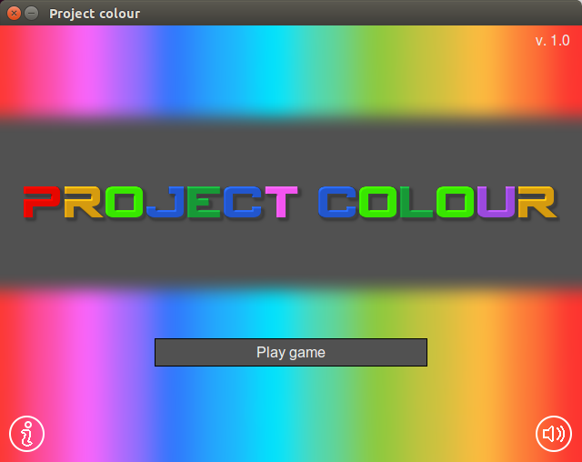
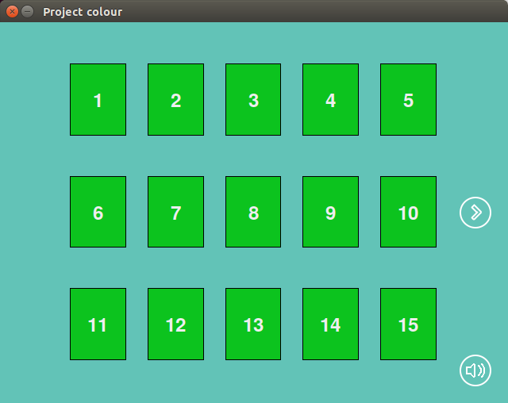
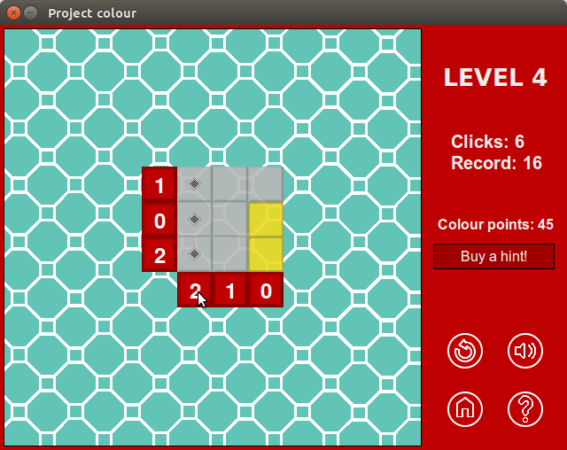
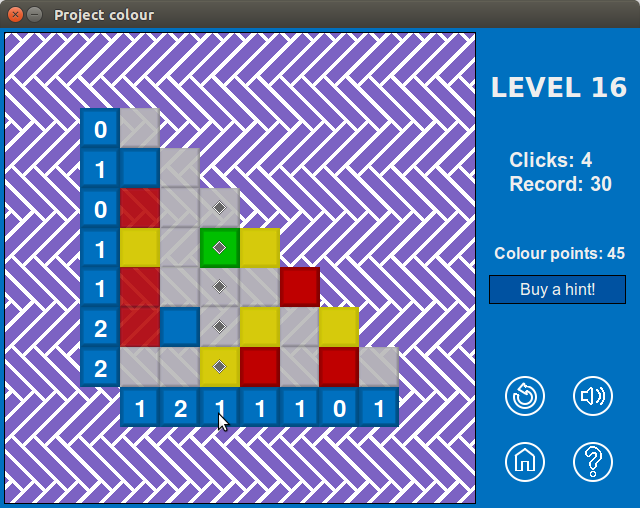

# Project Colour
## The game

Project Colour is a simple and colourful sudoku alike puzzle game developed in Python. With 50 playable levels, version 1.0 is available for both Windows and Ubuntu systems. 

## Downloading

For playing the game, you only need to download and uncompress the file on the `Windows` or `Ubuntu` folder. On Windows, you only need to open the `ProjectColour.exe` file. On Ubuntu, run the single `ProjectColour` binary file. Resources like those on the `images` folder may be customized by you as much as you like. Edited pictures, comments, and all kinds of feedback are welcomed and appreciated.

## Screenshots

